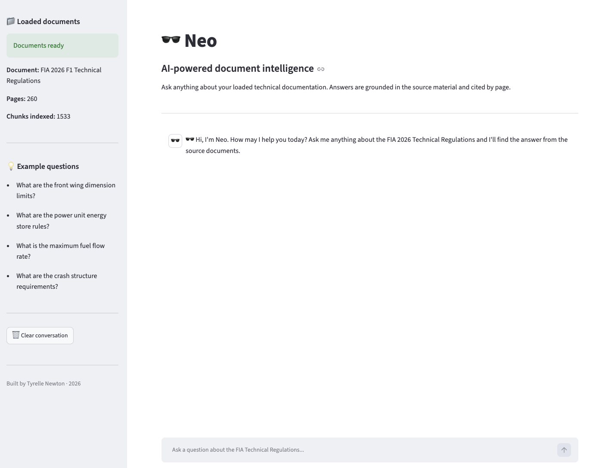

# 🕶️ Neo — AI-Powered Document Intelligence

Neo is an AI tool that lets you ask natural language questions about technical documents and get accurate, cited answers — grounded entirely in the source material.  


   

[Watch the video(https://www.loom.com/share/acdea16d75774d8491bdc0af44121e5a)]https://www.loom.com/share/acdea16d75774d8491bdc0af44121e5a

---

## The idea

Technical documents are dense. A 260-page regulatory document might contain the exact answer you need — but finding it manually takes time, and generic AI tools will guess rather than cite.

Neo solves this using RAG (Retrieval-Augmented Generation). It reads your documents, indexes them semantically, and when you ask a question it finds the most relevant passages and uses an LLM to generate a precise, sourced answer. If the answer isn't in the documents, it says so.

The demo uses the 2026 FIA Formula 1 Technical Regulations — but the architecture works for any domain.

---

## How it works — step by step

**Step 1 — Document loading**
Neo reads PDF files using `pypdf`, extracting text page by page and preserving the source and page number on every piece of content.

**Step 2 — Text chunking**
Each page is split into overlapping 500-character chunks. Overlapping ensures that meaning isn't lost at boundaries between chunks.

**Step 3 — Embeddings**
Every chunk is converted into a 384-dimensional vector using `sentence-transformers` (all-MiniLM-L6-v2). Similar meanings produce similar vectors.

**Step 4 — Vector search**
All vectors are stored in a FAISS index. When a question comes in, it's converted to a vector and the closest matching chunks are retrieved — semantic search, not keyword matching.

**Step 5 — Grounded generation**
The retrieved chunks are passed to OpenAI GPT-4o-mini as context. The LLM is instructed to answer only from that context and cite its sources. No hallucination.

**Step 6 — REST API**
The pipeline is wrapped in a Flask API with a `/ask` endpoint and a `/health` check — ready for any frontend or service to consume.

**Step 7 — Chat UI**
A Streamlit interface gives Neo a clean, chat-style frontend with source citations on every answer.

---

## Tech stack

| Layer | Technology |
|---|---|
| Language | Python 3.14 |
| LLM | OpenAI GPT-4o-mini |
| Embeddings | sentence-transformers (all-MiniLM-L6-v2) |
| Vector search | FAISS (Facebook AI Similarity Search) |
| PDF parsing | pypdf |
| REST API | Flask |
| UI | Streamlit |
| Environment | python-dotenv |

---

## Project structure

---

## Setup

**1. Clone the repo**
```bash
git clone https://github.com/Tee-35/neo.git
cd neo
```

**2. Create and activate a virtual environment**
```bash
python -m venv venv
source venv/bin/activate
```

**3. Install dependencies**
```bash
pip install -r requirements.txt
```

**4. Add your OpenAI API key**
```bash
cp .env.example .env
# Edit .env and add your key
```

**5. Add your PDF documents to the `/documents` folder**

**6. Run the Streamlit UI**
```bash
streamlit run neo_app.py
```

Or run the Flask API:
```bash
python phase6_flask_api.py
```

---

## API reference

### POST /ask
```json
Request:  { "question": "What are the front wing dimension limits?" }
Response: { "question": "...", "answer": "...", "sources": [...] }
```

### GET /health
```json
{ "status": "healthy", "documents_loaded": 1, "chunks_indexed": 1533 }
```

---

## Example questions

- What are the front wing dimension limits?
- What are the power unit energy store rules?
- What is the maximum fuel flow rate?
- What are the crash structure requirements?
- What materials are permitted for the survival cell?

---

## Planned extensions

- Multi-document upload via the UI
- Support for `.txt` and `.docx` file formats
- Persistent vector store (save/reload without re-embedding)
- Confidence scoring on retrieved chunks
- Deployment to cloud (Streamlit Cloud or AWS)

---

## About

Built as part of a career transition from data analytics into AI engineering. Demonstrates end-to-end RAG pipeline construction, LLM API integration, semantic search, REST API design, and practical AI tooling in Python.

10+ years of experience in F1 motorsport, NHS healthcare, and renewables — now applying that domain knowledge to AI engineering.

**Tyrelle Newton** — Data Analyst → AI Engineer
[LinkedIn](https://www.linkedin.com/in/tyrelle-newton/) · [GitHub](https://github.com/Tee-35)